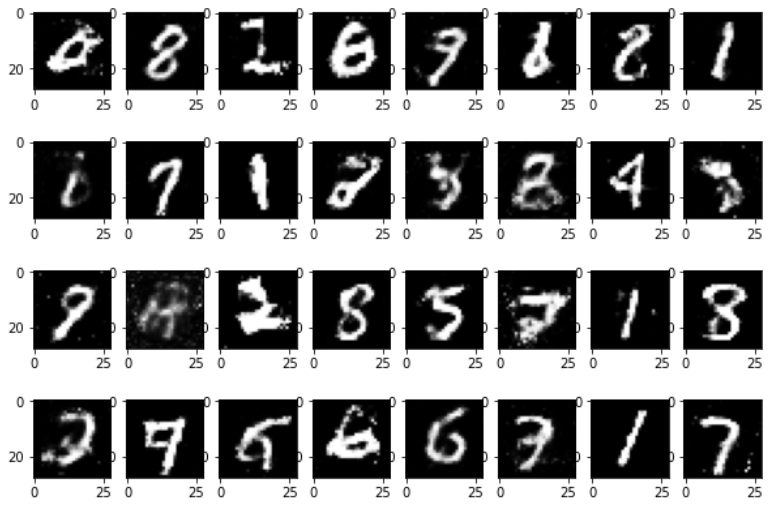

## Generative Adversial Networks

Generative Adversarial Networks, or GANs for short, are an approach to generative modeling using deep learning methods, such as convolutional neural networks. A bit complex definition I feel but what we do simply I believe is try to generated fake samples that seem real but are not. We control the realness using a discriminator which will take this fake image and classify it as fake or real. As we go on the generator tries to update it's weights so that it can fool the discriminator. So when it becomes exactly similar to the real image the discriminator would have a probablity of 50% of classifying it as fake.

## MNIST
For this implementation I used the MNIST dataset and trained it on 100 epochs with a learning rate of 0.001 using Adam optimizer for both the generator and the discriminator.

## Learn more about the GANs
Google has pretty good explaination on GANs and it can be viewed [here](https://developers.google.com/machine-learning/gan).

## Results
It gives pretty satisfactory results on chosing a random noise after using a simple GAN. Using a Conv layer might improve the performance more so planning to update once I learn about them too:)

## Outputs
This is the output I got after passing some random noise(uniformally distributed) to a trained Generative Network! Seems real cool right?

